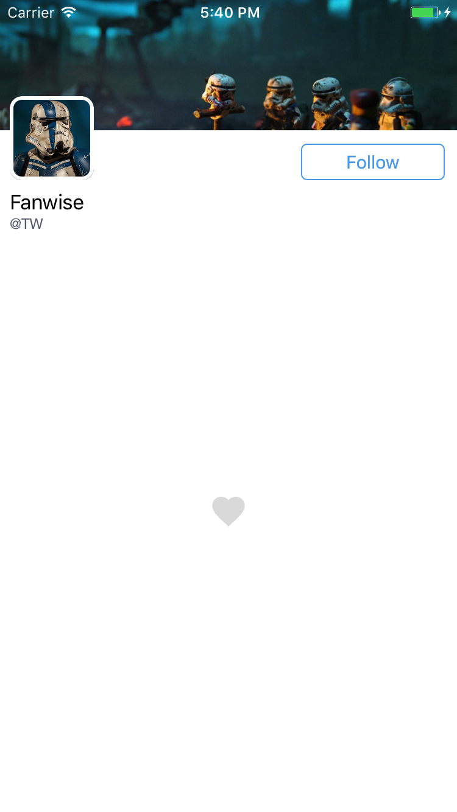
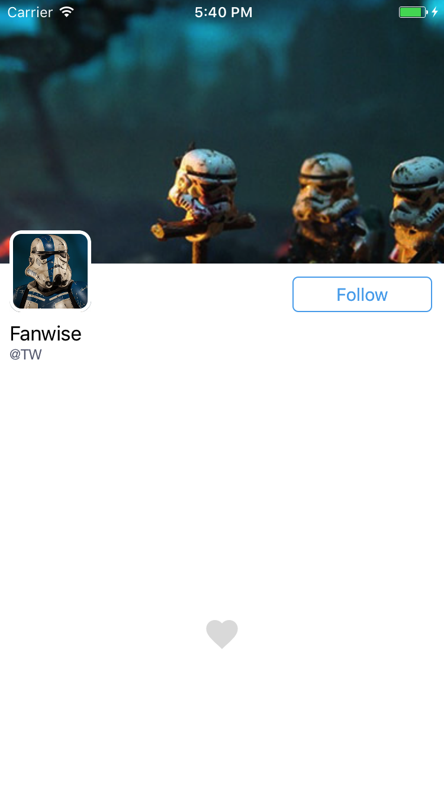

## MockTwitterUI
A simple mock Twitter UI demo.  
I read the [blog](http://www.thinkandbuild.it/implementing-the-twitter-ios-app-ui/) from Yari D'areglia and follow his [demo](https://github.com/ariok/TB_TwitterUI) to write this. Did a litte change and use Object-C. 

### normal

### pull down

### pull up
